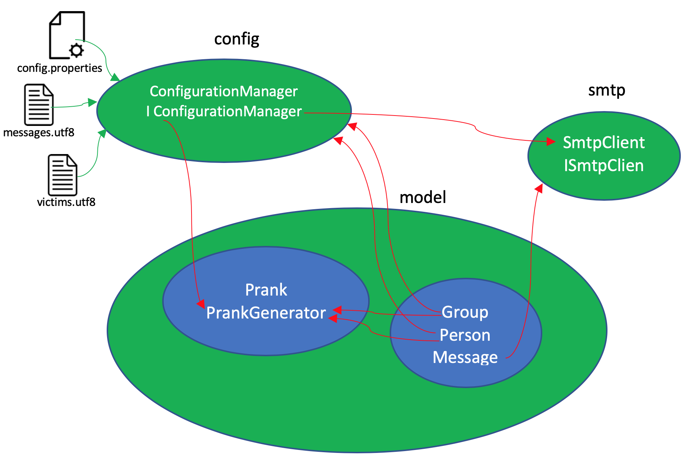
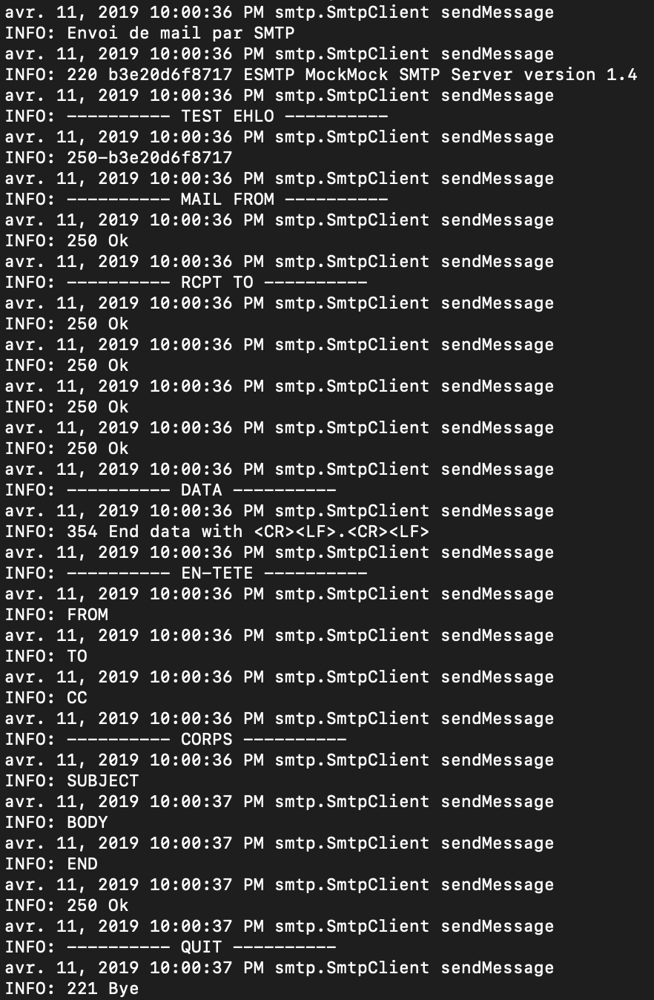
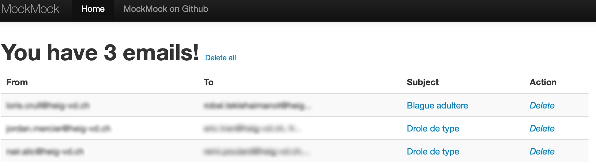
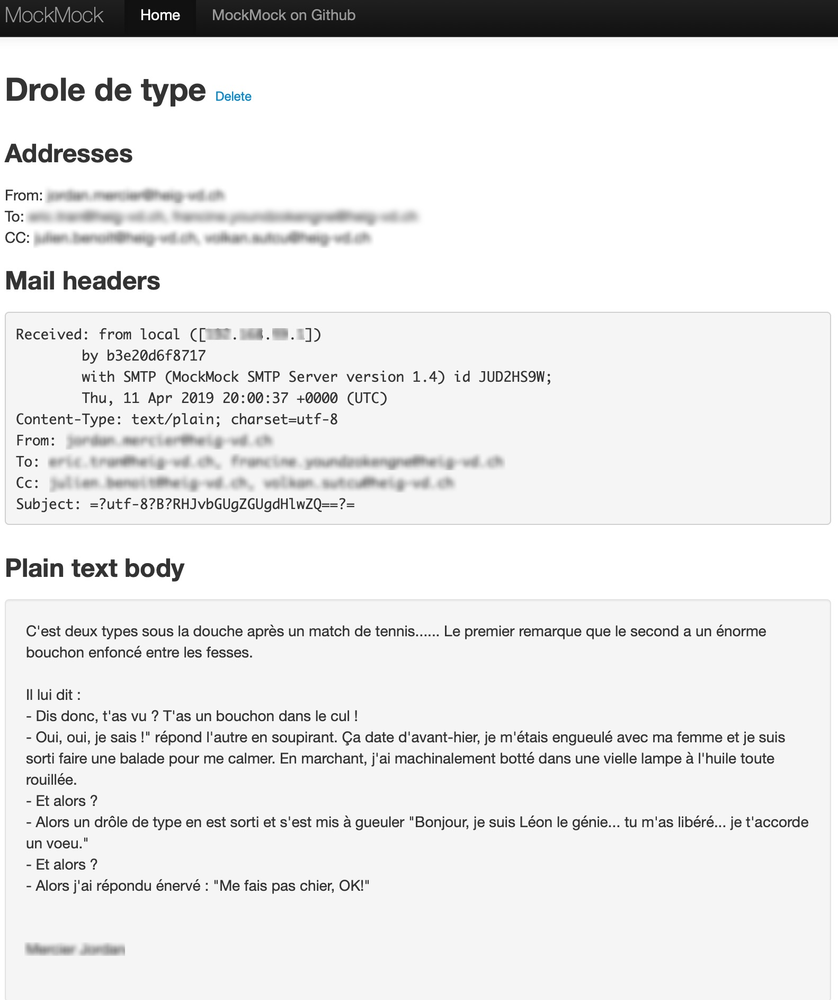

## Laboratoire: implémentation d'un serveur SMTP

Author: Volkan Sutcu, Benoit Julien  
Date: 11-04-2019

### Information importante pour les manipulations

Ce document permet à n'importe quel utilisateur de pouvoir mettre en place un serveur de test MockMock ainsi qu'un serveur d'envoi SMTP. En revanche, nous partons du principe que toute personne désirant effectuer l'installation complète possède et maîtrise les environnements Intellij, Github et Docker.

De plus, il faut avoir préparé l’environnement de travail au préalable en ayant cloné ou téléchargé le dossier GitHub "Teaching-HEIGVD-RES-2019-Labo-SMTP" via le lien Github qui vous a été fourni. Puis, créez un projet Maven sur la base de ce dernier. 

### Description du laboratoire

Le repo principal du serveur SMTP contient 2 dossiers pour le bon fonctionnement de ce dernier. Tout d'abord, un dossier config contenant un fichier du même nom permettant de configurer le serveur SMTP et 2 autres fichiers allant servir de base pour la construction d'une blague à envoyer à des destinataires.

Puis, dans un second temps, le dossier "src/main/java" qui contient tous fichiers d'implémentation du serveur. Nous retrouvons notamment un dossier "config" qui va permettre de gérer les informations contenues dans le dossier "config" à la racine décrite plus haut, un dossier "model" qui va servir à construire les éléments qui composent le mail, à savoir les personnes, groupes, le message et la blague. Puis, un dossier "smtp" contenant le serveur lui-même qui va se charger de construire et envoyer le mail.

Pour finir, un fichier "MailRobot.java" servant à appeler tous les éléments et à effectuer l'envoi du mail.

### Instructions de configuration du serveur MockMock

Afin d'utiliser le programme dans un environnement de test sans spammer de vrais destinataires, nous allons utiliser un serveur qui va simuler les différents envois. Ce dernier se nomme MockMock dont le `.jar ` est disponible dans le dossier Docker.

Puis, ouvrez un terminal docker et positionnez-vous dans le dossier Docker contenant le fichier "Dockerfile". Tapez ensuite la commande: `docker build -t mockmock .` . On va ici construire l'image nommé "mockmock" à partir du fichier Dockerfile.

Ensuite, tapez la commande qui suit: `docker run --name mockmock -it -p 25:25 -p 8282:8282 mockmock /bin/bash`. On va donc démarrer le conteneur nommé "mockmock" avec l'image construite en ouvrant un shell dessus et en mappant les ports 25 et 8282 à l'hôte afin d'autoriser la communication du serveur MockMock sur ces ports.

Une fois connecté au conteneur, pour démarrer le serveur, tapez: `java -jar ./opt/app/MockMock.jar` . Les informations de démarrage vont s'afficher. Pour tester que cela fonctionne, ouvrez un navigateur et tapez ce qui suit afin d'afficher l'interface de MockMock: `192.168.99.100:8282`.

### Instruction de configuration du serveur SMTP

Ensuite, il vous suffira de modifier le fichier "config.properties" via un éditeur de texte et de fournir l'IP Docker (en général 192.168.99.100), le numéro de port sur lequel le serveur SMTP va envoyer les mails (par défaut le 25), le nombre de groupe que vous voudriez former pour l'envoi des mails et pour finir, les personnes que vous désirez mettre en copie caché à vos mails.

Ensuite, il vous faudra modifier le fichier "messages.utf8" pour y inclure vos blagues qui seront ajoutées au mail envoyé. La règle pour ce fichier est la suivante: 

​	1) La première ligne concerne le sujet de la blague et doit être bref (sur une ligne)

​	2) La blague peut être écrite librement, avec/sans espace etc...

​	3) La séparation de chaque blague se fait comme suit: retour à la ligne 2 fois, puis ajout de "==" suivi 	d'un retour à la ligne, cette dernière permettant d'écrire le sujet de la nouvelle blague

Puis, modifiez le fichier "victims.utf8" en y ajoutant sur chaque ligne, les différentes personnes que vous voudriez voir apparaître dans la blague en tant qu'envoyeur ou receveurs du mail (le choix se fait automatiquement par le programme). Le nommage des adresses mails doit suivre les règles standards, à savoir: `xxx@yyy.zz`

Pour finir, exécutez la ligne de commande suivante en vous positionnant dans le dossier "Teaching-HEIGVD-RES-2019-Labo-SMTP » :  `java -jar ./smtpclient/target/smtpclient-1.0-SNAPSHOT-launcher.jar ./smtpclient/config/`. Vous verrez s'afficher une série de message. Si les messages `INFOS: Envoi de mail par SMTP` et `INFOS: "numéroX" Bye` apparaissent, le serveur a bien envoyé les mails aux destinataires.

### Description de l'implémentation du serveur SMTP

#### Config

`ConfigurationManager` et son interface `IConfigurationManager` permettent de récupérer les données d’un fichier de messages, ainsi que d’un fichier de victimes, tout deux en “UTF8” et de les traiter afin d’en extraire les données. Le fichier `config.properties` contient les 4 configurations suivantes :

- L’adresse IP du serveur SMTP
- Le port du serveur SMTP
- le nombre de groupe de victimes
- les adresses email qui se trouvent en copie

#### Model

Deux packages sont présents dans le package model. Le premier contient les fichier `Person`, `Group` et `Message` qui permettent de définir des groupes de personnes qui seront victimes des messages (prank). Ces derniers seront défini par un destinataire, un envoyeur, un sujet, ainsi qu’un corps de texte (le message en lui même).

Le second package contient les fichiers `Prank`et `PrankGenerator` qui génère une liste de « prank ». Ce dernier va utilisé la configuration faite par le fichier `ConfigurationManager` afin d’en extraire le nombre de groupe à générer pour créer le nombre de groupe avec des victimes aléatoires et préparer la liste de «prank » adéquate. C’est dans ce fichier (`PrankGenerator`) que le nombres d’email et que ceux-ci seront préparés. 

#### smtp

Le client `SmtpClient` et son interface `ISmtpClient` permettent l’envoie des commandes SMTP ainsi que l’envoie des messages. Le client SMTP prend en paramètre la configuration faite par le fichier `ConfigurationManager` afin d’en extraire l’adresse IP du serveur, ainsi que le port de ce dernier pour la création du Socket.

Voici un exemple de l’application en fonction :

- Ici, il s’agit des informations fournies par le client SMTP lors de l’envoie d’emails.

  

- Ici, un exemple du résultat sur le serveur MockMock (exécuté sur un conteneur docker)

  

  

